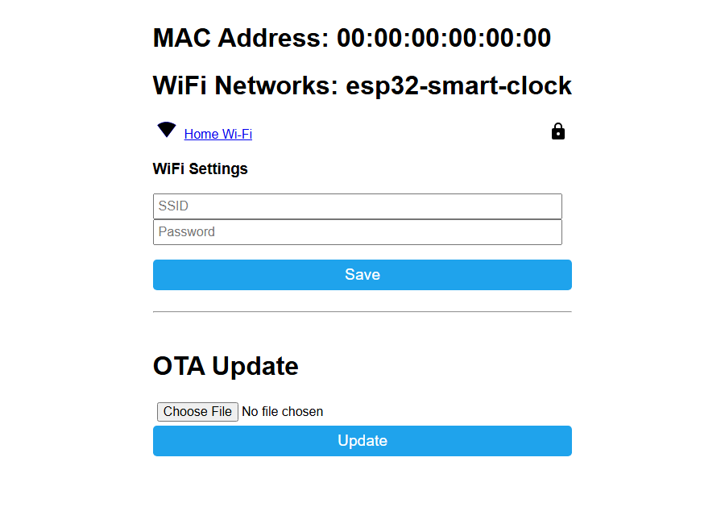

# ESP32 Smart Clock

ESP32 smart clock project with an 8x32 MAX7219 LED matrix, AHT20/BMP280 indoor sensors, an NS4168 I2S audio amplifier module, and Home Assistant control through ESPHome.

For normal use, install the **ESPHome smart clock firmware** from `esphome-smart-clock.yaml`.

## Quick Start

1. Install the tested ESPHome version: `python -m pip install "esphome==2026.9.0"`.
2. Copy `secrets.example.yaml` to `secrets.yaml`.
3. Put your Wi-Fi and ESPHome API key in `secrets.yaml`.
4. Connect the ESP32 with a USB data cable.
5. Compile and upload:

   ```powershell
   cd C:\workspace\esp32_smart_clock
   esphome compile esphome-smart-clock.yaml
   esphome upload esphome-smart-clock.yaml
   ```

6. Add the discovered ESPHome device in Home Assistant.

If upload fails, hold **BOOT** while upload starts, then release **BOOT** when writing begins.

## Recover Wi-Fi from your phone

The clock already includes **ESP32 Smart Clock Fallback**, a password-protected
Wi-Fi hotspot and setup page. No Bluetooth, app, Home Assistant connection, or
USB cable is needed to change the router name/password.

1. Power the clock normally. If its configured Wi-Fi network cannot be reached
   (for example, after changing the router password), wait **90 seconds**.
   The fallback hotspot starts automatically; there is no button to press.
2. On your phone, open **Settings > Wi-Fi** and join
   **ESP32 Smart Clock Fallback**.
3. Enter the hotspot password: the value of `fallback_ap_password` in your
   private `secrets.yaml`. This is separate from your home Wi-Fi password.
   Public release builds use the example value `CHANGE_ME_FALLBACK_AP_PASSWORD`.
4. Accept **Stay connected / Use without Internet** if prompted. If the setup
   page does not open automatically, open **http://192.168.4.1/** in your browser
   (HTTP, not HTTPS). Temporarily turn off mobile data or a VPN if your phone
   keeps routing away from the clock.
5. Select your home **2.4 GHz** Wi-Fi network, or enter its name manually, enter
   its password, and press **Save**. The ESP32 board used here cannot join 5 GHz.
6. Allow the clock to connect, then reconnect your phone to your normal network.
   The fallback hotspot shuts down after connection. If the password is wrong,
   reconnect to the fallback hotspot and try again.



*Screenshot of the original ESPHome 2026.9.0 portal rendered locally with
example network data. Your available networks will differ.*

The portal saves the new credentials on the clock across restarts. Also update
`wifi_ssid` and `wifi_password` in your local `secrets.yaml` before the next USB
build/upload, so a future firmware installation does not restore stale values.
Changing Wi-Fi here does not change the Home Assistant API encryption key.

To test recovery without changing your router, temporarily flash a local build
with a nonexistent Wi-Fi SSID, wait 90 seconds, then follow the steps above.
Keep a copy of your correct local settings. Do not reset or erase the device.

Reference: [ESPHome captive portal documentation](https://esphome.io/components/captive_portal/).

## Firmware Updates

For a personalized clock, update from your local ESPHome YAML. This preserves
your private `secrets.yaml` and any local config edits:

```powershell
esphome run esphome-smart-clock.yaml --device 192.168.1.99
```

Replace `192.168.1.99` with the clock IP address.

The GitHub release update entity checks public release binaries. Those binaries
are built in GitHub Actions with `secrets.example.yaml`, so they are useful as
reference/recovery artifacts but are not the normal update path for a device
that needs your local Wi-Fi/API secrets.

[](https://my.home-assistant.io/redirect/blueprint_import/?blueprint_url=https%3A%2F%2Fgithub.com%2FNirBY%2FESP32_Smart_Clock%2Fblob%2Fmain%2Fdocs%2Fblueprints%2Fautomation%2Fesp32_smart_clock_auto_update.yaml)

The button imports a safe check/notify blueprint. It does not install public
GitHub firmware unless you explicitly enable that option.

## Calendar Agenda Announcements

Home Assistant can read today's events from a calendar, print a compact agenda
on the LED matrix, and optionally speak the same agenda through the clock
speaker. The automation can run every day at a selected time, from an
`input_button` helper, or both.

[](https://my.home-assistant.io/redirect/blueprint_import/?blueprint_url=https%3A%2F%2Fgithub.com%2FNirBY%2FESP32_Smart_Clock%2Fblob%2Fmain%2Fdocs%2Fblueprints%2Fautomation%2Fesp32_smart_clock_calendar_agenda.yaml)

Create an `input_button` helper if you want a dashboard button, then import the
blueprint and select your calendar, clock speaker, and ESPHome display action.

## Tested software versions

| Component | Version |
|---|---|
| Clock firmware | 0.1.0-beta.14 |
| ESPHome | 2026.9.0 (see `ESPHOME_VERSION`) |
| PlatformIO Core (ESPHome dependency) | 6.1.19 |
| PlatformIO Core (separate Arduino builds) | 6.2.0 |
| Arduino PlatformIO platform | pioarduino 55.03.312 |
| Arduino-ESP32 / ESP-IDF | 3.3.12 / 5.5.5 |
| ESP32-A2DP | 1.8.11 |
| Adafruit AHTX0 / BMP280 / GFX | 2.0.6 / 3.0.0 / 1.12.6 |
| MD_MAX72XX | 3.5.1 |

The ESPHome firmware uses its own supported ESP-IDF toolchain. The Arduino
platform above is used for the separate hardware-test and Bluetooth builds.
Release CI installs the exact version in `ESPHOME_VERSION` and builds with
`secrets.example.yaml`; private local firmware binaries must not be published.

## Firmware Options

| Firmware | Use for | Home Assistant | Wi-Fi | Bluetooth music |
|---|---|---:|---:|---:|
| ESPHome smart clock | Clock, sensors, screen messages, alarm, Home Assistant speaker | Yes | Yes | No |
| Bluetooth speaker | Direct Bluetooth music from phone/PC | No | No | Yes |
| PlatformIO hardware test | Checking wiring and modules | No | No | No |

The ESP32 runs one firmware at a time. Flashing the Bluetooth speaker firmware replaces ESPHome. Flashing ESPHome again replaces the Bluetooth speaker firmware.

## Hardware Summary

- ESP32 30-pin dev board, CH340C, USB-C, HW-394 style board
- MAX7219 8x32 LED matrix
- NS4168 I2S Class-D audio amplifier module with speaker
- AHT20 + BMP280 I2C temperature, humidity, and pressure board
- 5V 3A USB-C power supply

Main pins:

| Function | ESP32 pin |
|---|---:|
| I2C SDA | GPIO21 |
| I2C SCL | GPIO22 |
| MAX7219 DIN | GPIO23 |
| MAX7219 CLK | GPIO18 |
| MAX7219 CS/LOAD | GPIO5 |
| I2S DATA | GPIO25 |
| I2S BCLK | GPIO26 |
| I2S LRCLK/WS | GPIO27 |

All module grounds must be connected together.

## Wiki

Detailed documentation was moved out of the README:

- [Wiki Home](docs/wiki/Home.md)
- [Hardware And Power](docs/wiki/Hardware-And-Power.md)
- [Install And Home Assistant](docs/wiki/Install-And-Home-Assistant.md)
- [Home Assistant Dashboard](docs/wiki/Home-Assistant-Dashboard.md)
- [Calendar And Announcements](docs/wiki/Calendar-And-Announcements.md)
- [Display Behavior](docs/wiki/Display-Behavior.md)
- [Audio And Music](docs/wiki/Audio-And-Music.md)
- [Logs And Troubleshooting](docs/wiki/Logs-And-Troubleshooting.md)
- [Development And Releases](docs/wiki/Development-And-Releases.md)

## Common Commands

Open logs over USB:

```powershell
esphome logs esphome-smart-clock.yaml --device COM5
```

Upload and keep logs open:

```powershell
esphome run esphome-smart-clock.yaml --device COM5
```

Upload an already compiled firmware over Wi-Fi by IP address:

```powershell
esphome upload esphome-smart-clock.yaml --device 192.168.1.99
```

Upload over Wi-Fi by IP address and keep logs open:

```powershell
esphome run esphome-smart-clock.yaml --device 192.168.1.99
```

For the separate Arduino builds, install PlatformIO 6.2.0 in its own environment
(ESPHome requires PlatformIO 6.1.19 in its environment):

```powershell
python -m venv .pio/core
.pio/core/Scripts/python.exe -m pip install "platformio==6.2.0"
```

Build the PlatformIO hardware test:

```powershell
.pio/core/Scripts/pio.exe run -e esp32dev
```

Build the Bluetooth speaker firmware:

```powershell
.pio/core/Scripts/pio.exe run -e bluetooth_speaker
```

## Notes

- Do not commit `secrets.yaml`; it is ignored by git.
- `GPIO5` is an ESP32 strapping pin. It is currently used for MAX7219 CS/LOAD, so avoid external pull-up/down effects on that pin.
- Hebrew MAX7219 font glyphs can be designed with [md_max72xx-font-designer](https://github.com/vasco65/md_max72xx-font-designer/tree/master).
- For audio noise or playback issues, see [Logs And Troubleshooting](docs/wiki/Logs-And-Troubleshooting.md) and [Audio And Music](docs/wiki/Audio-And-Music.md).
