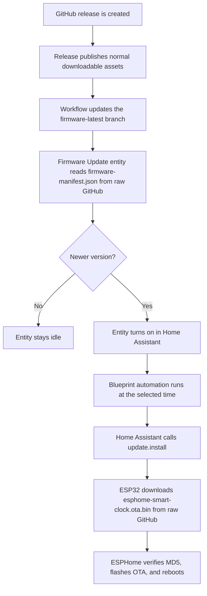

# Install And Home Assistant

## First-Time Install With ESPHome

Use this for the normal smart clock firmware.

### 1. Install The ESPHome Tool

On Windows, open PowerShell and run:

```powershell
python -m pip install esphome
```

Verify it installed:

```powershell
esphome version
```

If `esphome` is not found, try:

```powershell
python -m esphome version
```

### 2. Configure Wi-Fi

Create your private `secrets.yaml` from the dummy example, then edit it:

```powershell
cd Z:\workspace\esp32_smart_clock
Copy-Item secrets.example.yaml secrets.yaml
```

Set your real Wi-Fi name and password:

```yaml
wifi_ssid: "YOUR_WIFI_NAME"
wifi_password: "YOUR_WIFI_PASSWORD"
fallback_ap_password: "choose-a-password"
api_encryption_key: "paste-the-key-generated-by-esphome"
```

For `api_encryption_key`, the easiest path is to create a temporary ESPHome device in Home Assistant and copy the generated key, or use any valid ESPHome API encryption key.

Do not commit `secrets.yaml`. It is ignored by git. Only `secrets.example.yaml` should be pushed to GitHub.

### 3. Connect USB

1. Connect the ESP32 to the PC with a USB data cable.
2. Use USB power only while flashing.
3. If the LED matrix and speaker need external 5V during testing, keep grounds connected, but do not connect external 5V to VIN while USB is connected unless your exact ESP32 board safely supports it.

### 4. Compile And Upload

Run:

```powershell
cd Z:\workspace\esp32_smart_clock
esphome compile esphome-smart-clock.yaml
esphome upload esphome-smart-clock.yaml
```

When ESPHome asks, choose the USB serial port.

If upload fails, hold **BOOT** while upload starts, then release **BOOT** when writing begins.

### 5. Add To Home Assistant

1. Wait for the ESP32 to reboot.
2. It should connect to the Wi-Fi from `secrets.yaml`.
3. In Home Assistant, open Settings > Devices & services.
4. Add the discovered `ESP32 Smart Clock` ESPHome device.
5. Enter the API encryption key if Home Assistant asks.
6. Open the ESPHome integration device settings and enable "Allow the device to perform Home Assistant actions" if you want alarm events to trigger Home Assistant automations.

## Future Updates Over Wi-Fi

After the first USB flash, ESPHome OTA updates usually work over Wi-Fi.

From PowerShell:

```powershell
cd Z:\workspace\esp32_smart_clock
esphome upload esphome-smart-clock.yaml
```

ESPHome will upload wirelessly if the device is online. If OTA fails or the device is offline, connect USB and upload again.

From Home Assistant:

1. Install the ESPHome add-on if it is not installed.
2. Open ESPHome.
3. Import or create the `esp32-smart-clock` device.
4. Use the same YAML from `esphome-smart-clock.yaml`.
5. Click Install.
6. Choose Wirelessly for OTA updates, or USB/serial for first install.

## Home Assistant Control

For Home Assistant, use `esphome-smart-clock.yaml` with ESPHome. It exposes:

- `Temperature`, `Humidity`, and `Pressure` sensors
- `Screen Message` text entity
- `Display Brightness` number entity, range `0`-`15`
- display timing number entities for message/media/alarm/Wi-Fi/date/sensor screen durations and periodic intervals
- `Speaker` media player entity for Home Assistant TTS/audio
- `Hourly Beep Enabled` switch and quiet-hours controls for playing the local beep at the top of each hour
- `Firmware Update` update entity for GitHub release firmware
- `Alarm Enabled`, `Alarm Hour`, and `Alarm Minute` entities as alarm controls
- an `esphome.alarm_triggered` Home Assistant event when the alarm time is reached
- an `esphome.media_playback_failed` Home Assistant event when media starts and drops out quickly
- API actions:
  - `esphome.esp32_smart_clock_show_message`
  - `esphome.esp32_smart_clock_clear_message`

Important limitations:

- This hardware has a speaker only, not a microphone. It can play voice/TTS sent from Home Assistant, but it cannot listen for voice commands unless you add an I2S microphone.
- Wi-Fi music playback is through Home Assistant/ESPHome as a network media player. It is not a native Chromecast, AirPlay, Spotify Connect, or DLNA speaker.
- ESPHome does not expose media stream size before playback starts, so oversized streams cannot be rejected early. Fast playback failures show `AUDIO ERR` on the display and fire `esphome.media_playback_failed`.
- Changing the `Speaker` media-player volume plays a short local beep so you can hear the effective level immediately.
- The `Firmware Update` entity installs `esphome-smart-clock.ota.bin` from the raw GitHub `firmware-latest` branch through ESPHome HTTP OTA. It must use the OTA binary, not the factory binary.
- The alarm trigger sets the matrix to `ALARM` and fires an `esphome.alarm_triggered` event. Use a Home Assistant automation to play TTS or `media_player.play_media` on the `Speaker` entity.
- To allow the device to fire Home Assistant events, open the ESPHome integration device settings in Home Assistant and enable "Allow the device to perform Home Assistant actions".
- The ESPHome config uses the Google Font `Noto Sans Hebrew`, so first compile needs internet access from the ESPHome builder.
- The BMP280 address is set near the top of `esphome-smart-clock.yaml` as `bmp280_address`. Most combo boards use `0x77`, but some use `0x76`.

## Home Assistant Examples

Show a message:

```yaml
action: esphome.esp32_smart_clock_show_message
data:
  message: "GOOD MORNING"
```

Clear the message so the clock/sensors show again:

```yaml
action: esphome.esp32_smart_clock_clear_message
```

Send TTS to the speaker:

```yaml
action: tts.speak
target:
  entity_id: tts.home_assistant_cloud
data:
  media_player_entity_id: media_player.esp32_smart_clock_speaker
  message: "Wake up"
```

Alarm event automation example:

```yaml
alias: ESP32 smart clock alarm voice
triggers:
  - trigger: event
    event_type: esphome.alarm_triggered
actions:
  - action: tts.speak
    target:
      entity_id: tts.home_assistant_cloud
    data:
      media_player_entity_id: media_player.esp32_smart_clock_speaker
      message: "Wake up"
```

Media playback failure notification example:

```yaml
alias: ESP32 smart clock audio failed
triggers:
  - trigger: event
    event_type: esphome.media_playback_failed
actions:
  - action: persistent_notification.create
    data:
      title: ESP32 smart clock audio failed
      message: "The stream stopped quickly. Use 16 kHz mono or a smaller stream."
```

Automatic GitHub firmware update during a quiet maintenance window:

The easiest setup is the Home Assistant blueprint:

[](https://my.home-assistant.io/redirect/blueprint_import/?blueprint_url=https%3A%2F%2Fgithub.com%2FNirBY%2FESP32_Smart_Clock%2Fblob%2Fmain%2Fdocs%2Fblueprints%2Fautomation%2Fesp32_smart_clock_auto_update.yaml)

After import, select `update.esp32_smart_clock_firmware_update`, choose the
maintenance time, and save the automation.

The same automation is also available as `docs/home-assistant-auto-update.yaml`
if you prefer to paste YAML manually.

```yaml
alias: ESP32 smart clock auto firmware update
triggers:
  - trigger: time
    at: "03:15:00"
actions:
  - action: homeassistant.update_entity
    target:
      entity_id: update.esp32_smart_clock_firmware_update
  - delay: "00:00:10"
  - condition: state
    entity_id: update.esp32_smart_clock_firmware_update
    state: "on"
  - action: update.install
    target:
      entity_id: update.esp32_smart_clock_firmware_update
mode: single
```

How the GitHub update works:



Notes:

- Install the first firmware with `Firmware Update` manually. Future releases can
  be handled by Home Assistant.
- The update entity uses the `firmware-latest` branch, which is updated only after the release workflow builds and publishes a release.
- The raw GitHub update channel avoids GitHub release-download redirects with large HTTP headers, which can overflow the ESP32 HTTP client buffer.
- The automation installs only when the update entity is `on`.
- Use `esphome-smart-clock.ota.bin` for this path. The factory binary is only
  for USB/recovery flashing.

Notification-only GitHub firmware update check:

```yaml
alias: ESP32 smart clock firmware update available
triggers:
  - trigger: state
    entity_id: update.esp32_smart_clock_firmware_update
    to: "on"
actions:
  - action: persistent_notification.create
    data:
      title: ESP32 smart clock firmware update
      message: "A new GitHub release is ready. Open the Firmware Update entity to install it."
mode: single
```
